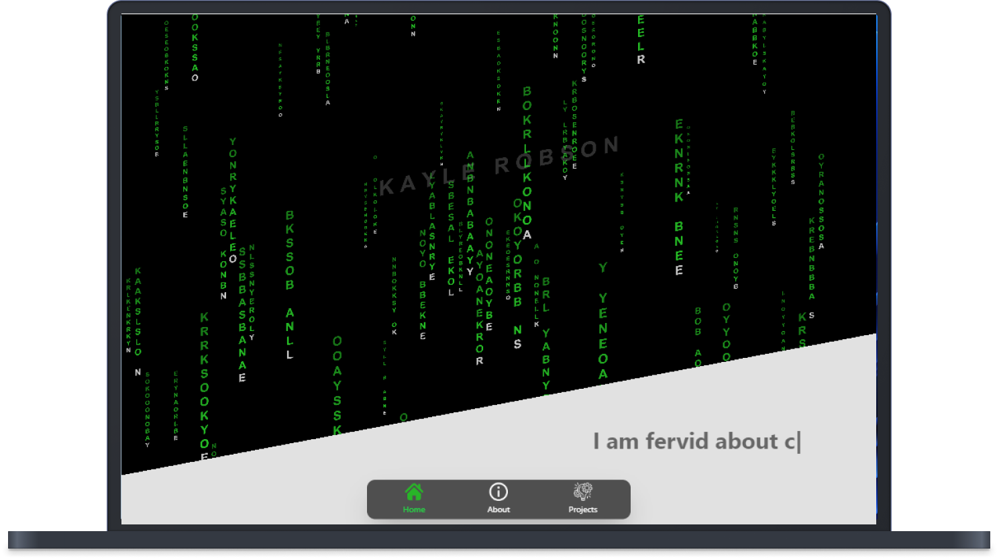

# 👩‍💻 Portfolio -  Frontend 
Personnel portfolio, displaying my projects and a summary of myself.  Built with React and React-dom.  I enjoyed learning P5 to create the following matrix affect with the letters in my name.  I also created a looping flicker with my name.  I did have a bit of problem with resetting the banner when the page was resized but I did solve it.  I used MUI, Framer-motion, Formik, and Toastify libraries.  I used SASS for the styling and stuck to the BEM convention.  

## 🚀 Demo
https://kaylerobson.com

## 📸 Images

## 💻 Built with
<li>React</li>
<li>P5</li>
<li>Type.js</li>
<li>MUI</li>
<li>Framer-motion</li>
<li>React-router-dom</li>
<li>react-dom</li>
<li>SASS</li>
<li>BEM</li>

## 🛠️ Installation Steps:
1. To start using this app you first need to clone the repository:

    git clone git@github.com:revyrob/portfolio.git

2. Then you will need to install all the required packages for the application. Run this command (if you're using npm):

    npm i

3. Run the frontend with the following command in the folder:

    npm start
    

## 🔮 Future Plans for Portfolio

<li>Create and add more projects!!</li>

